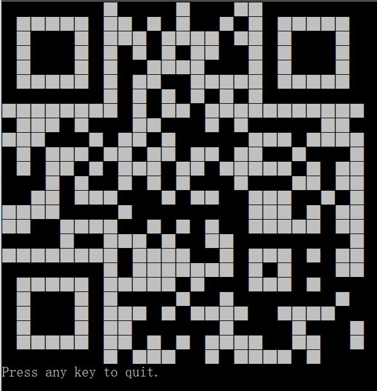
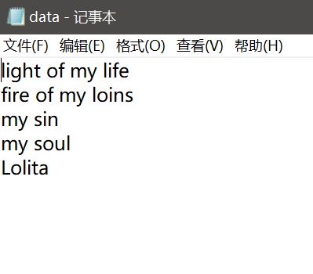
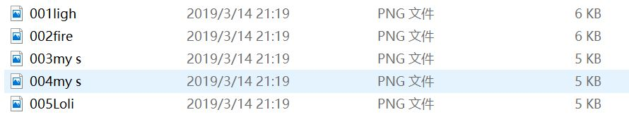
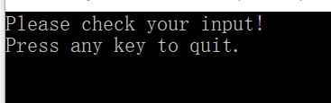
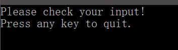
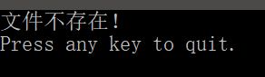
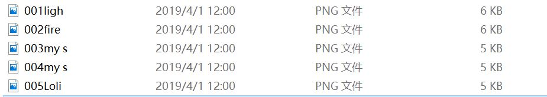
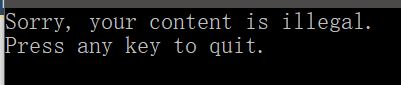

# Experiment1 C#控制台编程

## 一. 功能概述：

a. 当用户在命令行输入参数时（不含数字且长度不超过100），在控制台屏幕输出对应的二维码；

b. 如果输入不合要求，提示并结束运行；

c. 逐行读取文本文件并直接保存二维码的png格式图片到文件中。

## 二. 项目特色：

可通过读取文件的形式大量快速地生成二维码图片。

## 三. 代码总量：共128行

## 四. 工作时间：约6-7小时

## 五. 结论：

### 1. 实现在控制台打印二维码

在命令行输入参数“my experiment one"

运行结果如下：

使用手机扫码得到结果如下：

### 2. 实现从文本文件读入二维码并批量保存图片

在命令行输入参数”-f data.txt"

其中data.txt是一个保存有待生成二维码信息的文本文件，其内容如下：

程序运行后将每一行信息分别生成二维码保存到指定位置：

使用手机扫码得到部分结果如下：

### 3. 对异常情况的处理

#### a) 无参数输入的情况

提示检查输入：

#### b) 无文件地址的情况

提示检查输入：

#### c) 文件不存在的情况

提示文件不存在：

#### d) 第二次执行正确命令时覆盖原文件

成功覆盖：

#### e) 参数超出规定长度的情况

提示参数不合法：

